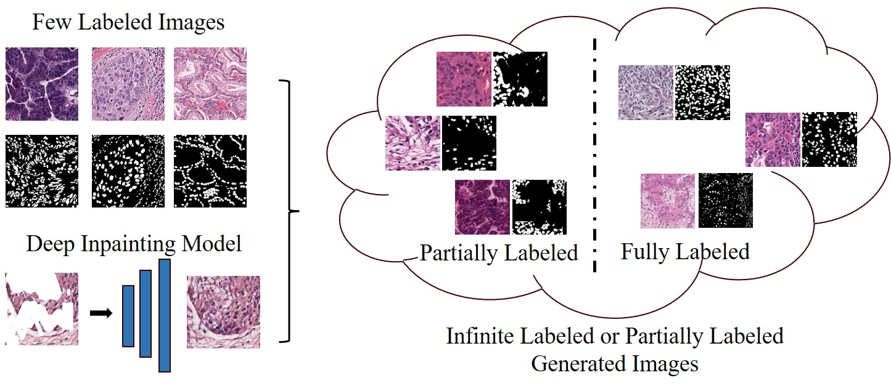
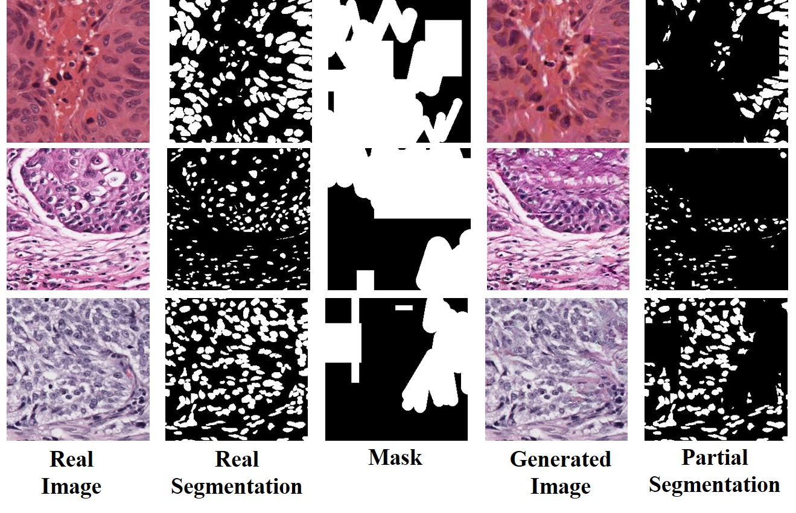
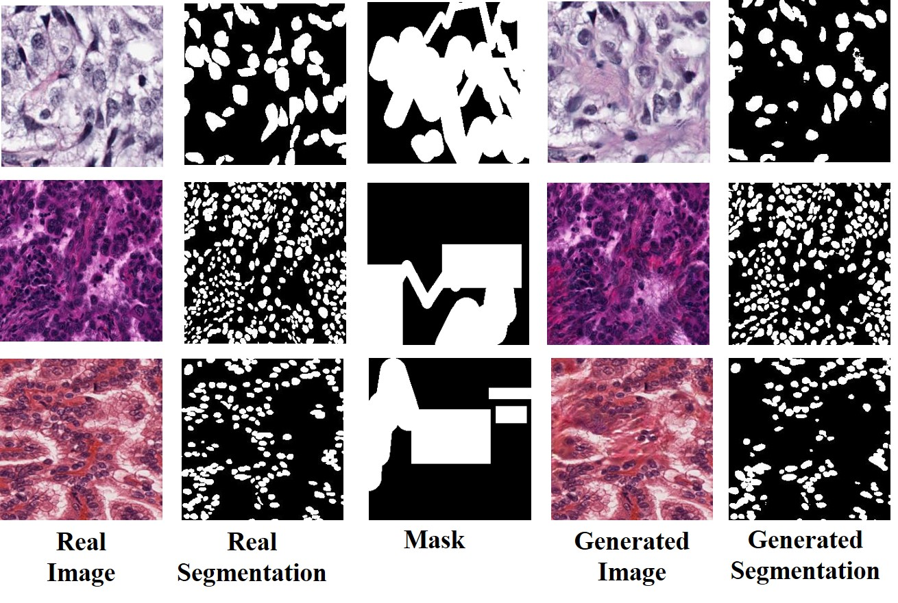
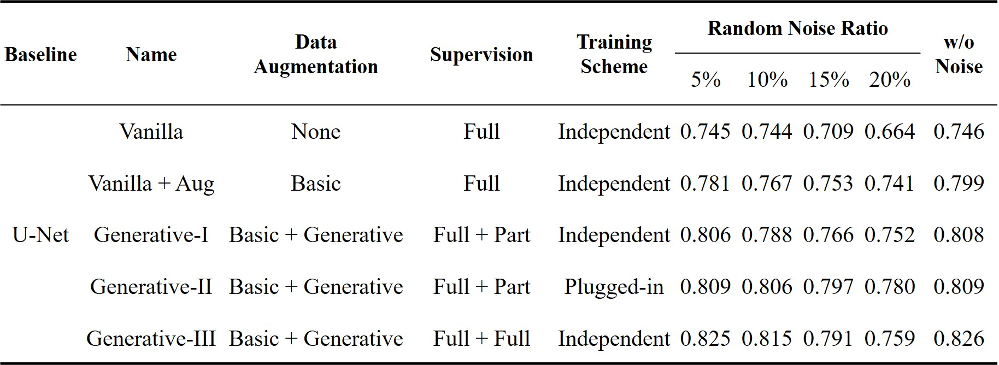
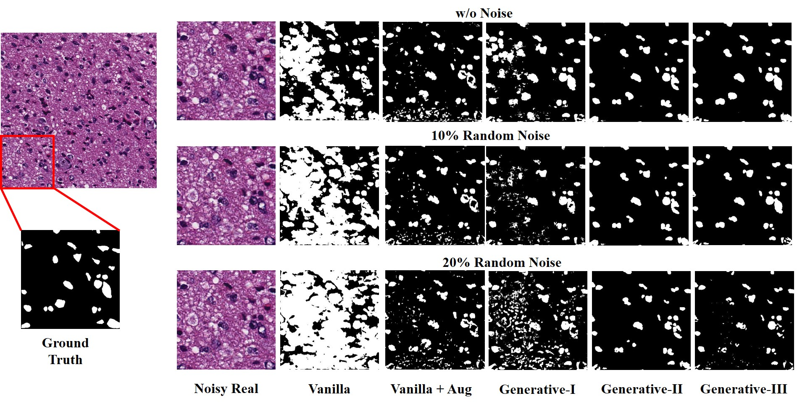

# Inpainting-based Labelled Data Augmentation and Segmentation Method for Cellular Images

**Final Project for _Deep Generative Models (Spring 2024)_ at _Peking University_**  
**北京大学“深度生成模型（2024年春季）”课程大作业——“基于图像修复的生物图像的有标签数据增强及分割方法”**


## Authors
Jimao JIANG （蒋济懋，智能学院）, Rongyu Zhu （朱容宇，数学科学学院）

<!-- ---------------------------------------------------- -->
## Introduction 
We present an inpainting-based data augmentation method to simultaneously generate cellular images and corresponding partial or full segmentations. Our contributions include:

1) **A Joint Generation Method for Both Images and Partial Labels with Dense Instances** 
2) **A Joint Generation Method for Both Images and Full Labels with Embeddable Segmentation Network.**


* Our project is based on SCAT [Arxiv Paper](https://arxiv.org/abs/2303.13133).
<!-- ------------------------------------------------ -->
## Results
### (I) Generating Images and Partial Labels

### (II) Generating Images and Full Labels

### (III) Comparison with Different Settings

_**Notes:**_
- **Basic**: Random crop, Random resize, Random flip, Color jitter
- **Vanilla**: Without any data augmentation.
- **Vanilla + Aug**: With only basic data augmentation.
- **Generative I**: Training UNet separately with the generated images and corresponding partial labels.
- **Generative II**: Using the plugged-in UNet when training the generative models.
- **Generative III**: Training UNet separately with the generated images and corresponding full labels from generative models and plugged-in UNet from Generative II.


<!-- -------------------------------- -->
## Prerequisites 
* python 3.8.8
* [pytorch](https://pytorch.org/) (tested on Release PyTorch 2.0.1 and torchvision 0.15.2)
* tensorboard 2.12.0
* numpy, PIL, tqdm...

<!-- --------------------------------- -->
## Datasets 

1. Download images and labels from Grand Challege for MICCAI 2018. [MoNuSeg](https://monuseg.grand-challenge.org/Data/)
2. Note that our models are trained using irregular masks from [PConv](https://github.com/NVIDIA/partialconv). 
For using random masks as in [Co-Mod-GAN](https://github.com/zsyzzsoft/co-mod-gan), you can specify `--mask_type random`, which may gain better performance.
3. Specify the path to training data by `--dir_image` and testing data by `--test_path`.

<!-- -------------------------------------------------------- -->

## Data Organization
To ensure seamless integration and functionality with our provided dataloaders (`data`), 
it is crucial to organize your dataset according to the following structure:
```
data/
   ├──train/
   │    ├── imgs/
   │    │    └── ...
   │    └── segs/
   │          └── ...
   └── test/
         ├── imgs/
         │    └── ...
         └── segs/
                └── ...         
```
And the generated images and labels will be organized as:
```
outputs/
└── outputs_256/
      ├──comp_results/  # Synthetic composite images
      │    └── ...
      ├──masked_segs(or full_segs)/  # Corresponding partial labels (or full labels) 
      │    └── ...
      ├──gts/  # Corresponding input images for generating
      │    └── ...
      ├──segs/  # Corresponding ground truth segmentations of the input images
      │    └── ...
      └── masks/ # Masks for inpaiting
            └── ...
```
<!-- -------------------------------------------------------- -->
## Getting Started
We only include the network plugged with the segmentation network. If you want to train the original inpainting network, you can remove all codes related to `self.netS`.
1. Training: 
    ```
    python train.py --dir_image [image path] --test_path [test image path] --transform randomcrop --mask_type random
    ```

2. Resume training:
    ```
    python train.py --resume 
    ```
   
3. Generate synthetic images and corresponding partial labels:
    ```
    python generate_part_labels.py --pre_train [path to pretrained model] --test_path [test image path] --outputs [output path] --num_test [number of generated images]
    ```

4. Generate synthetic images and corresponding full labels:
    ```
    python generate_full_labels.py --pre_train [path to pretrained model] --pre_train_seg [path to pretrained segmentation model] --test_path [test image path] --outputs [output path] --num_test [number of generated images]
    ```

5. Generate images and corresponding partial labels for a specific type of image:
    ```
    python generate_single_image.py --pre_train [path to pretrained model] --file_name [the name of the type] --test_path [test image path] --outputs [output path] --num_test [number of generated images]
    ```
   
6. Training U-Net from the generated partial or full images independently:
    ```
   cd UNet_SEG
   python train_unet.py --data_path_train [path to training data]
    ```

7. Testing U-Net for segmentation new images and calculating Dice Similarity Coefficients:
    ```
   cd UNet_SEG
   python test_unet.py --data_path_test [path to training data] --pre_train [path to pretrained model]
    ```
<!-- ------------------------------------------------------------------- -->

## Pretrained models
For pretrained models, please download from [MoNuSeg](https://pan.baidu.com/s/1_m91Okm9W99GHck9AMZb-g?pwd=0000).

**Corresponding File Names**:
1. **Generator**: `Generative.pt`.
2. **Discriminator**: `Discriminator.pt`.
3. **Plugged-in Segmentation Network**: `Plugged_UNet.pt`.
4. **UNet trained with generated images and part labels independently**: `Part_UNet.pt`.
5. **UNet trained with generated images and full labels independently**: `Full_UNet.pt`.

<!-- ------------------------ -->
## TensorBoard
Visualization on TensorBoard for training is supported.
Run `tensorboard --logdir [log_folder]` and open browser to view training progress. 


<!-- ------------------------ -->
## Acknowledgements
We would like to thank the contributors of image inpainting network we referred to: [SCAT](https://github.com/comzzw/Generative-Image-Inpainting).